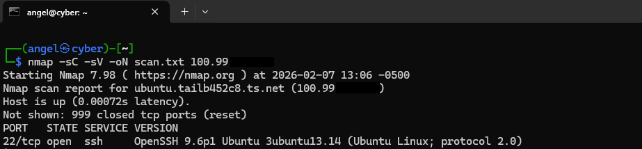
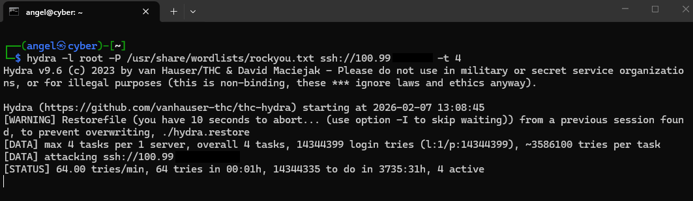

# Offensive Operations Log

## Objective
Simulate an external threat actor attempting to breach the internal network (`100.x.x.x`) to validate SIEM detection rules.

## Phase 1: Reconnaissance (Nmap)
**Goal:** Identify open ports and services on the target.

### Command Executed

```bash
# Scan specific target for service versions (-sV) and default scripts (-sC)
nmap -sC -sV -oN scan_results.txt <TARGET_IP>
```

## Scan Results (Nmap)



## Delivery (Hydra)
Execute a brute-force attack against the SSH service to generate "Noise" for the SIEM.


