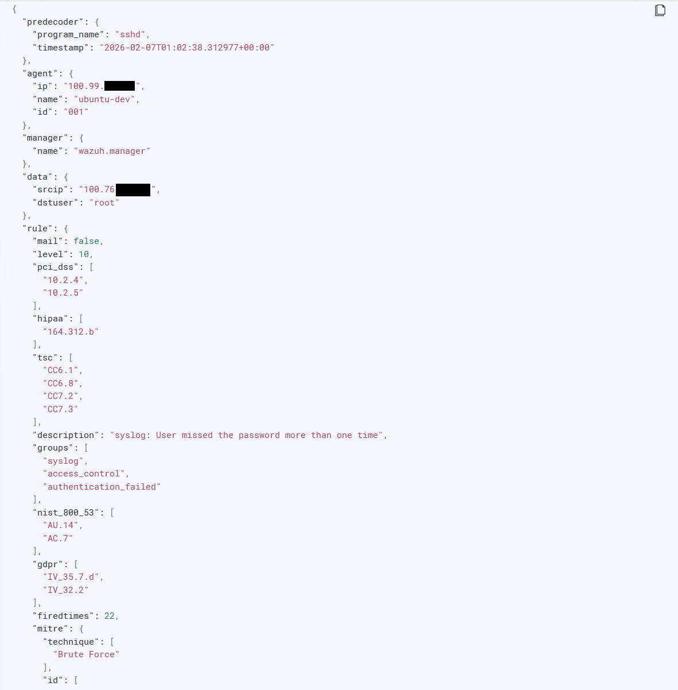

# Defensive Operations Log (Blue Team)

## Objective
Detect and analyze the brute-force attack signatures generated by the Red Team operations using Wazuh SIEM.

## Alert Detection
Trigger: The SIEM successfully correlated multiple authentication failures into a high-severity alert.

### Evidence

Rule 2502 "User missed the password more than one time" triggered at Level 10 severity)

### Alert Analysis
* **Rule ID:** `2502` (aggregated from Rule `5716` failures).
* **Technique:** [MITRE ATT&CK T1110](https://attack.mitre.org/techniques/T1110/) (Brute Force).
* **Timeline:** Feb 06, 2026 @ 20:02:39.

## Forensic Analysis
Goal: Identify the attacker's IP address and the specific account targeted.

### Evidence

Expanded event data revealing the attacker's source IP

### Key Findings

1.  **Attacker IP (`data.srcip`):** `100.76.x.x` (Confirmed Internal Tailscale Node).
2.  **Target User (`data.dstuser`):** `root`.
3.  **Log Source:** `/var/log/auth.log` on the Ubuntu Agent.
4.  **Full Log Message:**
    > "PAM 3 more authentication failures; logname= uid=0 euid=0 tty=ssh ruser= rhost=100.76.x.x user=root"

## Incident Response

In a production environment, this alert would trigger the following automated response:
1.  **Active Response:** Firewall drop rule applied to `100.76.x.x`
2.  **Notification:** Alert sent to the SOC team.
