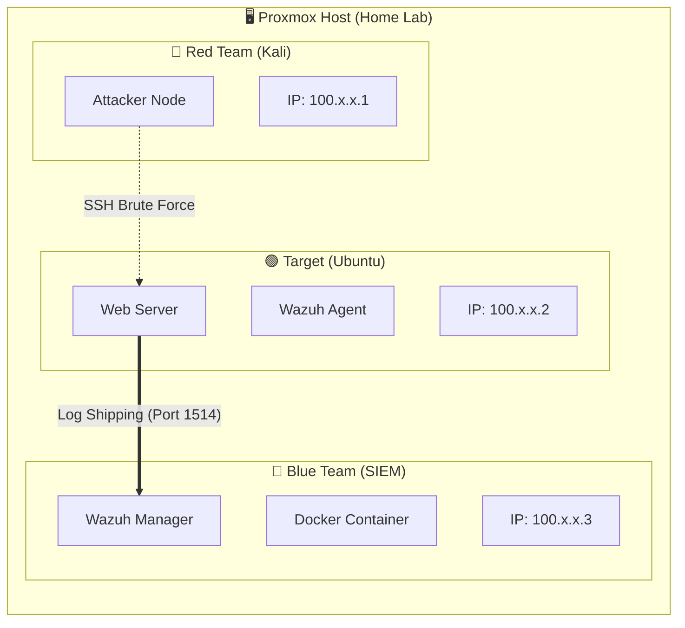

# Security Operations Center (SOC) Lab

## Summary
This project simulates a real-world cyberattack lifecycle to engineer a robust defense system. I deployed a Security Information and Event Management (SIEM) solution within a segmented home lab environment to monitor, detect, and analyze live threats.

The lab demonstrates an end-to-end security workflow:
1.  **Infrastructure:** Establishing a Zero-Trust mesh network.
2.  **Offense:** Executing controlled brute-force attacks.
3.  **Defense:** Analyzing logs and configuring automated alerts.

## Project Modules

| Module | Description | Key Tech |
| :--- | :--- | :--- |
| [**01-Infrastructure**](./01-infrastructure) | **Network Engineering:** Secure mesh networking, VM provisioning, and segmentation. | Proxmox, Tailscale, Ubuntu |
| [**02-Offensive Ops**](./02-offensive) | **Red Team Simulation:** Service enumeration and automated dictionary attacks (Hydra). | Kali Linux, Nmap, Hydra |
| [**03-Defensive Ops**](./03-defensive) | **Blue Team Analysis:** Log ingestion, threat correlation, and forensic investigation. | Wazuh, Docker, Syslog |

## Network Topology
The environment utilizes Tailscale to create an encrypted overlay network, isolating the lab from the physical home LAN.

## Technologies
• Hypervisor: Proxmox VE 

• SIEM: Wazuh

• Networking: Tailscale

• Tools: Nmap, Hydra, Docker, Linux

## Disclaimer
This project is for educational purposes only. All attacks were simulated in a controlled, isolated environment owned by the author.
